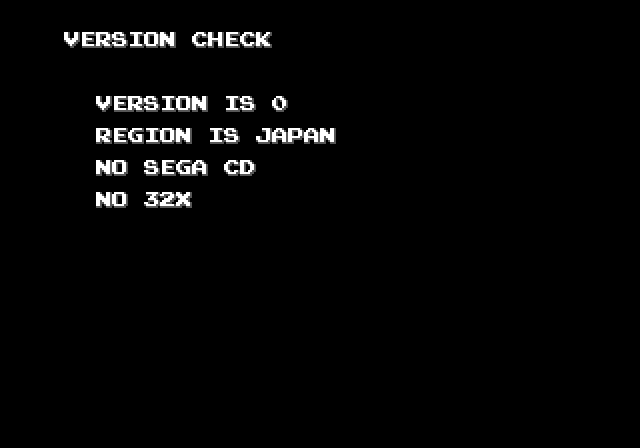

# Version checker

Quick version and region checker for Mega Drive. It checks which version is
your hardware (0 to 15) as well as which region it thinks it is. Also it
looks for the add-ons because why not.

No license for this thing, do whatever you want with it.

## Building

On Linux:

* Grab an assembler and [`mdtiler`](https://github.com/sikthehedgehog/mdtools)
* Modify `build.sh` to point to the tools
* Run it

On Windows: ...look at `build.sh` and write the equivalent BAT file :P
